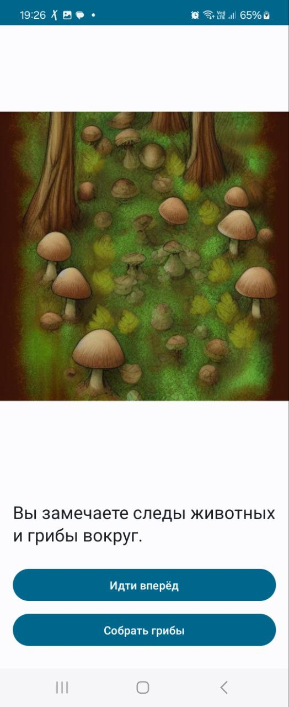

# Greedy Goblin

**Greedy Goblin** — это мобильная игра в стиле DnD, где игроки могут участвовать в созданных сценах,
принимая решения и взаимодействуя с другими игроками.
Цель игры — предоставить игроку захватывающий сюжет с элементами мультиплеера и процедурной генерации контента,
предлагая на выбор действия, влияющие на развитие сюжета.

## Визуальный интерфейс мобильного приложения

)

## Документация

1. Маркетинг и аналитика
    1. [Целевая аудитория](./docs/01-biz/01-target-audience.md)
    2. [Заинтересанты](./docs/01-biz/02-stakeholders.md)
    3. [Пользовательские истории](./docs/01-biz/03-bizreq.md)
2. Аналитика:
    1. [Функциональные требования](./docs/02-analysis/01-functional-requiremens.md)
    2. [Нефункциональные требования](./docs/02-analysis/02-nonfunctional-requirements.md)
3. Архитектура
    1. [ADR](docs/03-architecture/01-adrs.md)
    2. [Описание API](docs/03-architecture/02-api.md)
    3. [Компонентная схема](docs/03-architecture/03-arch.md)
4. DevOps
    1. [Файлы сборки](./deploy)
5. Тесты

# Структура проекта

## Плагины

### Плагины Gradle сборки проекта

1. [build-plugin](build-plugins) Модуль с плагинами
2. [JvmBuildPlugin](build-plugins/src/main/kotlin/JvmBuildPlugin.kt) Плагин для сборки проектов JVM
2. [MultiplatformBuildPlugin](build-plugins/src/main/kotlin/KmpBuildPlugin.kt) Плагин для сборки
   мультиплатформенных проектов

## Проектные модули

### Транспортные модели, API

1. [specs](specs) - описание API в форме спецификаций
2. [rest-api-v1](greedy-goblin-be/rest-api-v1) - генерация транспортных моделей REST-версии API
для JVM с использованием kotlinx.serialization
3. [greedy-goblin-common](greedy-goblin-be/greedy-goblin-common) - модуль с общими классами для модулей проекта. В
частности, там располагаются внутренние модели и контекст.
4. [greedy-goblin-log](greedy-goblin-be/greedy-goblin-log) - Мапер между внутренними моделями и
моделями логирования

### Фреймворки и транспорты

1. [greedy-goblin-api](greedy-goblin-be/greedy-goblin-api) - Api-приложение на Ktor

### Модули бизнес-логики

1. [greedy-goblin-biz](greedy-goblin-be/greedy-goblin-biz) - Модуль бизнес-логики приложения: обслуживание стабов,
   валидация, работа с БД

## Библиотеки

### Мониторинг и логирование

1. [deploy](deploy) - Инструменты мониторинга и деплоя
2. [greedy-goblin-lib-logging-common](greedy-goblin-libs/lib-logging-common) - Общие объявления для
   логирования
3. [greedy-goblin-lib-logging-kermit](greedy-goblin-libs/lib-logging-kermit) - Библиотека логирования
   на базе библиотеки
   Kermit
4. [greedy-goblin-lib-logging-logback](greedy-goblin-libs/lib-logging-logback) - Библиотека логирования
   на базе библиотеки Logback

## Тестирование

### Сквозные/интеграционные тесты

1. [e2e-be](greedy-goblin-tests/e2e-be) - Сквозные/интеграционные тесты для бэкенда
   системы