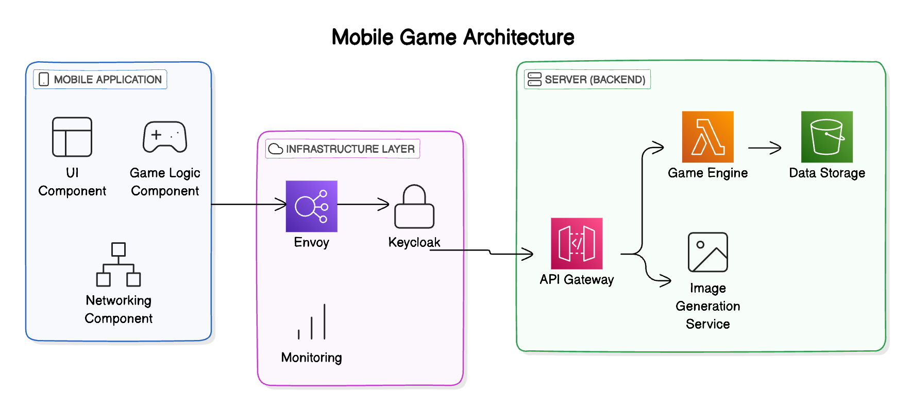

# Архитектурная диаграмма

## Диаграмма компонентов

- **Описание**: Диаграмма представляет основные компоненты MVP-версии игры, включая:
    - инфраструктурный слой (Envoy, Keycloak, Monitoring);
    - серверную часть (API Gateway, Game Engine, Data Storage, Image Generation);
    - мобильное приложение (UI, Game Logic, Networking).

Эта схема описывает взаимодействие ключевых модулей, необходимых для начального этапа разработки.

